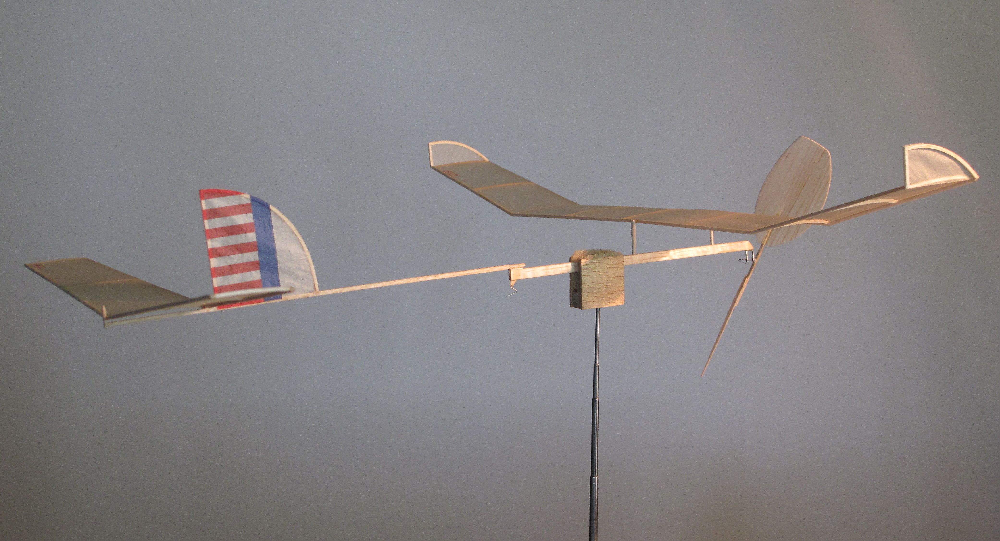

Hodson's Flight Data
####################

Gary Hodson kept records for many of his flights with versions of the Wart A-6
model. He provided that data as part of my study in the form of an Excel
spreadsheet. The columns in this spreadsheet are as follows:

..  note:: 

    Units are in parentheses)

- A: Flying site and Year
- B: :math:`H` - Ceiling height (feet) 
- C: :math:`\Phi` - Propeller pitch (degree)
- D: :math:`w_m` - Motor weight in gram)
- E: :math:`m_w` - Motor width  (inch/1000)
- F: :math:`m_t` - Motor thickness (inch/1000)
- G: :math:`m_x` - Motor cross section area = E*F (inch**2) 
- H: :math:`m_l` - Motor length (inch)
- I: :math'`n` - Winding Turns (turn)
- J: Turn density = I/H (turn/inch) 
- K: :math:`Q` - Torque (inch * ounce)
- L: :math:1t_m` - time (minute)
- M: :math:`t_s` - Time (second)
- N: :math:`t` - Flight time = L*60 + M (second)
- O: Average propeller speed = I/N (turn/second)
- P: :math: m_v` - Motor volume = G * H (inch ** 3)
- Q: = P / D (inch**3/gram)
- R: = P/I (inch**3/turn)
- S: = R / I (inch**3/turn**2)
- T: He = B/(483 * U)
- U: Wm/W = D/(1.2 + D)
- V: = 6.61 * D
- W: Nbreak = 45.257 * H/sqrt(D/H) (turn)
- X: %Nb = I / W
- Y: t/Rd = N/J
- Z: Navg/pitch = N/J
- AA: Navg/Q = O/K

It appears that Gary is using Mark Drela's paper to calculate the energy
available for a given motor, and a variation of Don Slusarczyk's scheme to
calculate the motor breaking winds. 

Based on the formulas in this spreadsheet, the recorder motor length is actually twice the loop length. 

Breaking turns
==============

Don Slusarczyk published an article on calculating the breaking turns of a rubber motor. His formulas were as follows:

Given:

    - n_br = break turns
    - m_l = loop length * 2 
    - m_w motor weight
      
The **K** factor is given as

..  math::

    l_l = m_l / 2
    K =fact(n_{br}/l_l)\sqrt((m_w/l_l)) 

Example Data
============

Using Gary's record setting flight data, let's check things out using python
and the *Python* *units* package **pint**:

- :math:`H` = 147 * feet
- :math:`\Phi` = 48 * degree
- :math:`W_m` = 3.1 * gram
- :math:`m_t` = 36/1000 * inch
- :math:`m_w` = 38/1000 * inch
- :math:`m_l` = 18 * inch
- :math:`n` = 3660 * turn
- :math:`Q` = 3.1 * inch * ounce
- :math:`t_m` = 10 * minute
- :math:`t_s` = 18 * second

Here is the code that processes this data:

..  literalinclude::    ../../src/wart_data.py
    :linenos:

And, here is the result:

..  program-output:: python ../src/wart_data.py
