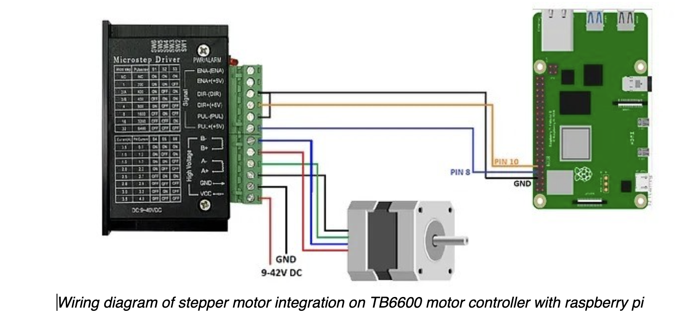

Test Page - not for publication
###############################

.. math:: e^{i\pi} + 1 = 0
   :label: euler

Euler's identity, equation :eq:`euler`, was elected one of the most
beautiful mathematical formulas.

.. tikz:: An Example TikZ Directive with Caption
   :align: left

   \draw[thick,rounded corners=8pt]
   (0,0)--(0,2)--(1,3.25)--(2,2)--(2,0)--(0,2)--(2,2)--(0,0)--(2,0);

See :cite:`black2022` for more information.

Here is a basic control setup:

