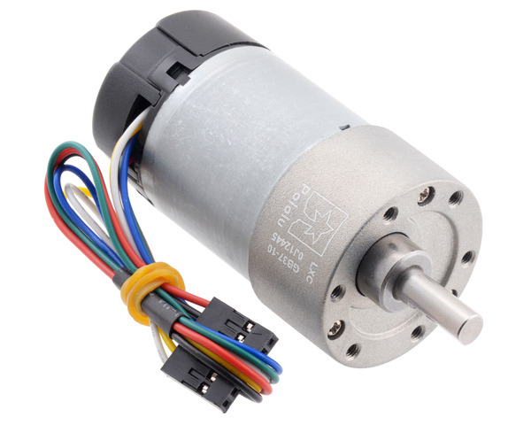

Winding the Motor
#################

Once we can generate the stretching force on the motor, we need to begin winding. Here we have options: we could use another stepper motor, or a simple electric motor mounted on the sliding platform. The nice thing about using a stepper motor is that we know exactly how the shaft is moving. With a simple D.C. motor, we would need a way to count the turns we are generating. Common solutions to that problem involve mounting some kind of optical sensor to count the turns. FOr simplicity, I elected to use the D.C motor option, since I had an available devicem and the windong speed is higher than I can get with a stepper motor.

D.C Motor Selection
===================

I have purchased a number of motors for my student projects over the years. One
of my favorite suppliers for these is `Pololu Robotics and Electronics
<https://www.pololu.com/>`_. The motor I selected for my test device is this:

	

(`reference <https://www.pololu.com/product/4758>`_

There is one concern with using this motor directly to wind the motor.
Depending on the tension in the motor, the pull on the shaft might cause
excess internal friction. Since I have no idea what kinds of bearings are
inside the gearbox, it might be necessary to use this motor to drive a hook that
can stand the tension. This is easy enough to do with more gears and a simple
bearing, but it complicates the design. 

This particular motor has an encoder that will let us count the revolutions of the drive shaft, and runs on 12 volts. Obviously, we will need to get both power and encoder signals out to the tester computer setup using a cable assembly capable of following the motor as it slides across the linear rail. More on this later.
